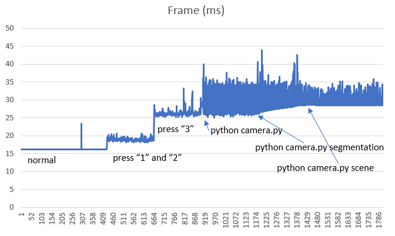

# Camera Views

The camera views that are shown on screen are the camera views you can fetch via the [simGetImage API](apis.md).

From left to right is the depth view, segmentation view and the FPV view.

## Depth View

The depth view provides a ground truth depth map image.  This depth is computed from the 3D model information and therefore can
be used to test any other algorithm that tries to compute depth from the images.

## Segmentation View

This view randomly colors objects in the scene based on information on how the 3D model was built.  These colors are currently
random, so they contain no semantic tagging.  For example, in the above picture the hedge in the forground is made up of separate
hedge segments so each segment gets a different color as a result, even though it is the same type of hedge.

If you want your Unreal environment to provide colors that are meaningful, then override FlyingPawn::setupStencilIDs() function or 
assign proper values in CustomDepthStencilValue property in object browser window in Unreal Editor, then remove the random 
assignment that is happening in AFlyingPawn::setStencilIDs.

## FPV View

This view is simulating a fixed forward pointing camera on the drone.  Note however, that this camera switchs places with the
main game view if the user presses '[' or ']'.  

## Performance

Now rendering these views does impact the FPS performance of the game, since this is additional work for the GPU.  The following shows the impact on FPS when you open these views.

This is measured on Intel core i7 computer with 32 gb RAM and a GeForce GTX 1080
graphics card running the Modular Neighborhood map, using cooked debug bits, no debugger or GameEditor open.  The normal state with no subviews open is measuring around 16 ms per frame, which means it is keeping a nice steady 60 FPS (which is the target FPS).  As it climbs up to 35ms the FPS drops to around 28 frames per second, spiking to 40ms means a few drops to 25 fps.

The simulator can still function and fly correctly when all this is going on even in the worse case because the physics is decoupled from the rendering.  However if the delay gets too high such that the communication with PX4 hardware is interrupted due to overly busy CPU then the flight can stall due to timeout in the offboard control messages.

On the computer where this was measured the drone could fly the path.py program
without any problems with all views open, and with 3 python scripts running 
to capture each view type.  But there was one stall during this flight, but it
recovered gracefully and completed the path.  So it was right on the limit.

The following shows the impact on CPU, perhaps a bit surprizingly, the CPU impact is also non trivial.

